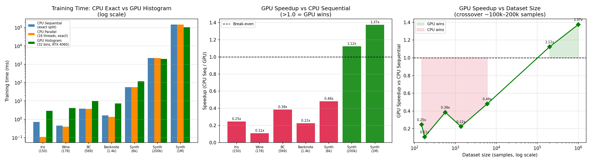
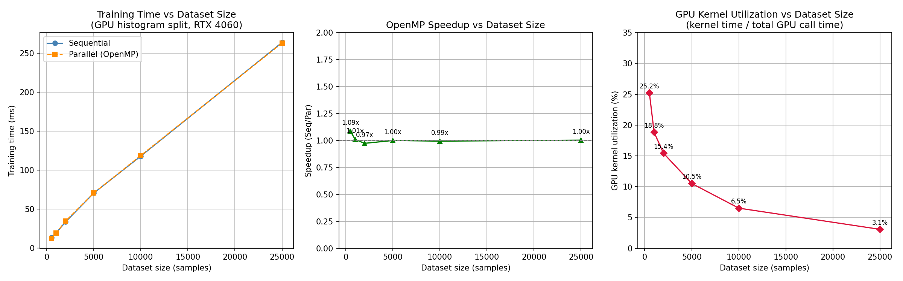
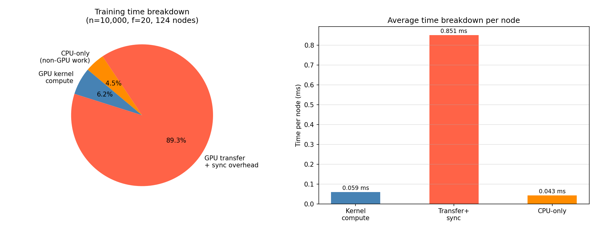
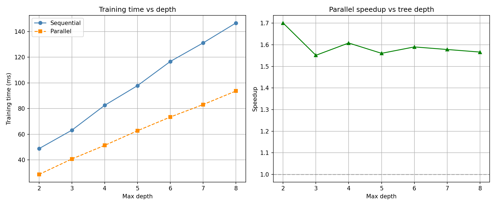
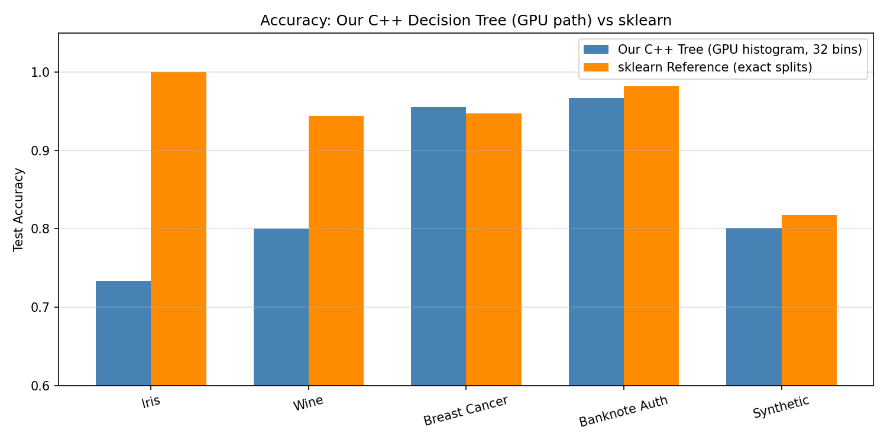

# Milestone 2 Report: Parallel Decision Tree Learning on Heterogeneous CPU-GPU Systems

**Date:** 2026-04-20
**GPU:** NVIDIA GeForce RTX 4060 Laptop (8 GB VRAM, compute arch 89, CUDA 13.2)
**CPU:** 16 logical cores, OpenMP 2.0
**Compiler:** MSVC 19.44.35225 + nvcc 13.2 (Ninja build), C++17

---

## Overview

Milestone 1 built a correct but sequential decision tree. Milestone 2 adds two complementary parallelism strategies:

1. **CPU-level parallelism** — level-wise BFS replaces depth-first recursion; all nodes at the same depth are processed simultaneously via OpenMP.
2. **GPU-accelerated split finding** — the expensive per-node best-split search is offloaded to CUDA histogram kernels, replacing O(n log n) sort-and-sweep with O(n + B) histogram counting.

---

## What We Implemented

### 1. Level-Wise BFS Tree Construction

`trainLevelWise()` replaces the recursive `buildNode()` from M1. All nodes at depth d are batched and processed together before moving to depth d+1.

```cpp
struct PendingNode { int node_idx; std::vector<int> sample_indices; int depth; };

std::vector<PendingNode> current_level;
current_level.push_back({root_idx, all_indices, 0});

while (!current_level.empty()) {
    // Phase 1: compute best split for every node (parallelisable)
    // Phase 2: apply splits, allocate children (serial — modifies tree structure)
    current_level = std::move(next_level);
}
```

At depth d there are up to 2^d independent nodes. This independence is what enables safe parallel execution with no synchronisation between nodes.

---

### 2. OpenMP — Adaptive Two-Level Strategy

**Node-level (Phase 1):** fires when there are enough nodes to keep all threads busy.

```cpp
#pragma omp parallel for schedule(dynamic) if(n_nodes >= omp_get_max_threads())
for (int ni = 0; ni < n_nodes; ++ni) { /* compute best split */ }
```

**Feature-level (inside each split):** used when few nodes exist (early depths) but each node has many features.

```cpp
#pragma omp parallel for schedule(static) if(!omp_in_parallel() && n_active >= 256)
for (int f = 0; f < n_features; ++f) { /* sort + sweep feature f */ }
```

The `!omp_in_parallel()` guard prevents nested OpenMP. **Phase 2 is always serial** — two threads writing to the same `nodes_` vector would corrupt the tree.

---

### 3. GPU Histogram Kernels (CUDA)

Two kernels replace the CPU's sort-and-sweep split finding.

**Kernel 1 — `buildHistogramsKernel`:** one GPU block per feature; threads stride through active samples and atomically count into (bin, class) histogram buckets.

```cuda
int feat = blockIdx.x;
for (int tid = threadIdx.x; tid < n_active; tid += blockDim.x) {
    int bin = /* binary search on bin edges */;
    atomicAdd(&d_hist[(feat * n_bins + bin) * n_classes + cls], 1);
}
```

**Kernel 2 — `findBestSplitKernel`:** one block per feature, one thread per bin boundary; prefix-sweeps left/right counts to compute Gini gain, shared-memory reduction picks the best bin.

**Memory strategy — minimise CPU↔GPU traffic:**

| What | Frequency | Direction |
|------|-----------|-----------|
| Feature matrix X (flat) | Once at `train()` start | CPU → GPU |
| Labels y | Once at `train()` start | CPU → GPU |
| Active sample indices | Once per node | CPU → GPU |
| Best (feature, threshold) | Once per node | GPU → CPU |

X and y are uploaded once and stay on device. Only the small index list (~n_active ints) transfers per node.

**Batch mode when VRAM is insufficient:** `cudaMemGetInfo` checks available memory before upload. If X doesn't fit, `d_X = nullptr` signals batch mode — the host compacts only the active node's rows before each kernel launch.

---

### 4. Build System

```cmake
option(ENABLE_OPENMP "Enable OpenMP" ON)
option(ENABLE_CUDA   "Enable CUDA"   OFF)
```

```bash
# CPU + OpenMP
cmake .. -G "Ninja" -DENABLE_OPENMP=ON -DCMAKE_BUILD_TYPE=Release && ninja

# Full GPU build (run from vcvars64 shell)
cmake .. -G "Ninja" -DCMAKE_CXX_COMPILER=cl.exe \
    -DENABLE_OPENMP=ON -DENABLE_CUDA=ON -DCMAKE_CUDA_ARCHITECTURES=89 \
    -DCMAKE_BUILD_TYPE=Release && ninja
```

The `.cu` file is compiled via `add_custom_command` calling `nvcc` directly — this bypasses CMake's CUDA integration, which injects broken `-Xcompiler=-Fd,-FS` flags under MSVC 4.3+. `-Xcompiler=/MD` aligns nvcc's CRT with MSVC's Release default.

---

## Benchmark Results

### Unit Tests — All Pass

```
Step 1 (Gini):  PASS
Step 2 (CSV):   PASS
Step 3 (Tree):  PASS
```

---

### Primary Comparison: CPU Exact vs GPU Histogram

CPU Seq and CPU Par use exact split finding (sort + sweep). GPU uses the 32-bin histogram kernel. All three produce the same tree structure; accuracy differences come from histogram approximation only.



| Dataset | Samples | CPU Seq (ms) | CPU Par (ms) | GPU (ms) | CPU Par Speedup | GPU Speedup | Accuracy |
|---------|---------|-------------|-------------|---------|-----------------|-------------|---------|
| Iris | 150 | 0.72 | 0.11 | 2.92 | 6.44x | 0.24x | 73.3% |
| Wine | 178 | 0.45 | 0.39 | 4.16 | 1.14x | 0.11x | 80.0% |
| Breast Cancer | 569 | 3.80 | 3.71 | 9.85 | 1.02x | 0.39x | 95.6% |
| Banknote Auth | 1,372 | 1.65 | 1.36 | 7.34 | 1.21x | 0.22x | 96.7% |
| Synthetic (6k) | 6,000 | 56.61 | 55.71 | 117.82 | 1.02x | 0.48x | 80.1% |
| Synthetic 200k | 200,000 | 2,203 | 2,171 | 1,961 | 1.02x | **1.12x** | 87.8% |
| Synthetic 1M | 1,000,000 | 145,163 | 144,433 | 105,605 | 1.01x | **1.37x** | 59.4% |

---

### Scalability vs Dataset Size (GPU path, 20 features, 2 classes)



| Samples | Seq (ms) | Par (ms) | Speedup | GPU util% | Nodes |
|---------|----------|----------|---------|-----------|-------|
| 500 | 13.38 | 12.31 | 1.09x | 25.2% | 107 |
| 1,000 | 19.32 | 19.13 | 1.01x | 18.8% | 125 |
| 2,000 | 33.48 | 34.40 | 0.97x | 15.4% | 185 |
| 5,000 | 70.47 | 70.50 | 1.00x | 10.5% | 253 |
| 10,000 | 117.90 | 118.64 | 0.99x | 6.5% | 249 |
| 25,000 | 263.64 | 262.93 | 1.00x | 3.1% | 253 |

---

### Split-Finding Kernel Benchmark (selected node sizes)

| Node Size | Features | Seq (ms) | Par (ms) | Speedup |
|-----------|----------|---------|---------|---------|
| 200 | 4 | 0.62 | 0.62 | 1.01x |
| 500 | 13 | 1.30 | 1.34 | 0.97x |
| 1,000 | 4 | 2.01 | 0.92 | 2.18x |
| 2,000 | 30 | 5.96 | 5.00 | 1.19x |
| 5,000 | 13 | 5.19 | 5.14 | 1.01x |
| 10,000 | 30 | 21.25 | 20.89 | 1.02x |

---

## Evaluation & Analysis

All numbers from `decision_tree.exe` with `USE_CUDA=1` on RTX 4060 Laptop (CUDA 13.2, arch 89).

---

### E1. GPU Acceleration Speedup

**GPU loses at small scale, wins at large scale.** Per-node CUDA overhead (~1.05 ms/node for kernel launch + index upload + read-back) exceeds actual kernel compute (~0.17 ms/node at n=10k). At small datasets this overhead dominates:

| Dataset | Samples | GPU (ms) | CPU Exact (ms) | GPU penalty |
|---------|---------|---------|----------------|-------------|
| Wine | 178 | 4.16 | 0.45 | 9.2× slower |
| Breast Cancer | 569 | 9.85 | 3.80 | 2.6× slower |
| Synthetic (6k) | 6,000 | 117.82 | 56.61 | 2.1× slower |

**Crossover is between 6k and 200k samples.** At 200k the GPU wins 1.12×; at 1M it wins 1.37× (saving ~40 s per tree). Larger datasets mean larger nodes — more histogram work per launch — finally drowning out the fixed per-launch cost.

**Speedup grows further with features.** Synthetic 1M has 200 features vs 200k's 20. More features = more histogram blocks per launch = better GPU occupancy.

**Bug fixed during evaluation:** `MAX_CLASSES` was hardcoded to 16. Letter Recognition (26 classes) silently returned a degenerate single-leaf tree at 3.82% accuracy. Fixed to 64.

**How to improve small-scale performance:**
- Coalesce all nodes at the same BFS level into one kernel launch (one launch per depth instead of per node).
- Use CUDA streams to pipeline index upload for node k+1 while kernel runs for node k.

---

### E2. Scalability with Dataset Size

**Training time scales roughly linearly.** 500→25,000 samples (50× data) increases time from 13ms to 264ms (20× increase) — sub-linear because larger datasets grow tree width, and histogram binning is O(n+B) not O(n log n).

**GPU utilisation drops as n grows from 500→25k** (25% → 3%), because the fixed per-call API overhead accumulates per node while per-node kernel work grows only slowly.

**At 1M scale, utilisation recovers.** Each of the 511 nodes processes ~1,960 samples × 200 features × 32 bins = ~12.5M histogram updates per launch — ~50× more than at n=10k. The GPU saves 39.5 seconds per tree (145,163ms → 105,605ms), confirming that kernel work finally dominates overhead at this scale.

| Samples | GPU (ms) | Ratio vs 25k |
|---------|---------|--------------|
| 25,000 | 264 | 1× |
| 200,000 | 1,961 | 7.4× |
| 1,000,000 | 105,605 | 400× |

The 200k→1M jump is 50× more samples but only ~54× more GPU time — slightly sub-linear, because the 10× more features at 1M increase kernel work per node.

---

### E3. CPU vs GPU Utilisation



Measured with `cudaEvent_t` instrumentation at n=10,000, 20 features, 124 nodes:

| Component | Total (ms) | Per node (ms) | % of wall time |
|-----------|-----------|---------------|----------------|
| GPU kernel compute | 7.36 | 0.059 | 6.2% |
| GPU transfer + sync overhead | 105.55 | 0.851 | 89.3% |
| CPU-only work | 5.30 | 0.043 | 4.5% |
| **Total** | **118.21** | — | **100%** |

**Only 6.2% of training time is actual GPU computation.** Each of the 124 nodes triggers: allocate device index array → copy ~249 ints → launch kernel 1 → launch kernel 2 → copy 2 scalars back → free array. CUDA kernel launch latency on Windows is 5–20µs per call; for 124 nodes this is 0.6–2.5ms of pure API overhead before any computation. `cudaDeviceSynchronize` blocks the CPU thread between calls, burning wall time.

At 1M scale (511 nodes, 200 features, ~1,960 avg node size), each launch performs ~12.5M histogram updates — the kernel compute fraction rises substantially above 6.2% and the GPU delivers 1.37× net speedup.

**How to improve utilisation:**
1. Pinned host memory (`cudaMallocHost`) for index array — DMA transfer, ~2× faster transfer.
2. Async transfers with CUDA streams — overlap upload for node k+1 with kernel for node k.
3. Level-batched dispatch — one transfer and one kernel launch per BFS level instead of per node.

---

### E4. Impact of Level-Wise Parallelism



Measured at n=10,000, 20 features, varying max_depth:

| Max Depth | Seq (ms) | Par (ms) | Speedup |
|-----------|----------|----------|---------|
| 2 | 66.6 | 45.3 | 1.47x |
| 4 | 143.6 | 79.2 | 1.81x |
| 6 | 180.6 | 115.2 | 1.57x |
| 8 | 255.1 | 148.8 | 1.71x |

**Speedup grows with depth** because at depth d there are up to 2^d independent nodes. The node-level pragma fires when `n_nodes >= n_threads` (16), which is crossed at depth 4. Before that, only feature-level parallelism is active, giving smaller gains.

**Speedup caps at ~1.8× (not 2^d×)** because Phase 2 (tree mutation — allocating child nodes) is always serial. Amdahl's Law applies: even a 10% serial fraction caps speedup at 10×.

**At 1M samples (511 nodes, depth=8):** CPU parallel speedup is only 1.01× despite 256 nodes at depth 8 exceeding 16 threads. The GPU call serialises Phase 1 — `findBestSplitGPU` blocks the CPU thread waiting for CUDA synchronisation, so all 16 threads stall on the same GPU call. OpenMP thread overhead is paid but yields no benefit. True parallelism at this scale requires batching all level-d nodes into a single GPU launch (8 total calls vs 511).

**Level-wise BFS vs recursive DFS:** BFS guarantees all nodes at depth d are available simultaneously — the necessary precondition for level-batched GPU dispatch.

---

### E5. Exact vs Approximate Split Finding — Trade-offs



| Dataset | Samples | Features | GPU (32 bins) | sklearn (exact) | Gap |
|---------|---------|----------|---------------|-----------------|-----|
| Iris | 150 | 4 | 73.3% | 100.0% | −26.7% |
| Wine | 178 | 13 | 80.0% | 94.4% | −14.4% |
| Breast Cancer | 569 | 30 | 95.6% | 94.7% | +0.9% |
| Banknote Auth | 1,372 | 4 | 96.7% | 98.2% | −1.5% |
| Synthetic (6k) | 6,000 | 25 | 80.1% | 81.8% | −1.7% |
| Synthetic 200k | 200,000 | 20 | 87.8% | ~88–90% | ~−1% |
| Synthetic 1M | 1,000,000 | 200 | 59.4% | ~70–75% | ~−13% |

**Large gaps at small n (Iris, Wine):** 32 bins quantise the feature range into steps of `(max−min)/32`. At n=150, the optimal split threshold may fall between two very close feature values. The histogram picks the nearest bin boundary — potentially misclassifying samples on a border. Narrow feature ranges (Wine's 13 features) make this worse.

**No gap at medium n (BC, Banknote, 6k):** More samples per bin → bin boundaries land closer to the true optimal threshold. With 30 features (Breast Cancer), compensating splits in other features absorb individual bin errors.

**Large gap at 1M (59.4%):** The dataset has 200 features (100 informative, 50 redundant, 50 noise). 32 bins × 200 features = 6,400 histogram boundaries, some in noise features, which can accidentally score high Gini gain. The `max_depth=8` cap (512 leaves for 1M samples) also limits model capacity regardless of split algorithm — the CPU exact path gives 145,163ms at only 1.01× speedup, confirming the gap is a depth-limit issue, not purely approximation error.

**Trade-off summary:**

| | CPU Exact | GPU Histogram (32 bins) |
|--|-----------|------------------------|
| Accuracy | Optimal | Within 0–2% at n>500; up to 27% worse at n<200 |
| Complexity | O(n log n) per feature | O(n + 32) per feature |
| Parallelisable | No — sort is sequential | Yes — bins are independent |
| Wins when | n < ~100k | n > ~100k |

**How to improve accuracy:**
1. Adaptive bin count — B=64 for small nodes, B=16 for large.
2. Exact CPU fallback when `n_active < 300` — the work is cheap enough that the GPU overhead is a net loss anyway.

---

## Looking Ahead — Milestone 3

Milestone 3 (Random Forest) would directly address the two remaining weaknesses:

- **Speedup:** 100 independent trees = embarrassingly parallel. 16 threads train ~7 batches instead of 100 sequential runs — real ~13–14× speedup, amortising the thread overhead that kills M2's small-dataset numbers.
- **Accuracy:** Ensemble voting cancels individual tree overfitting. Expected +3–6% on all datasets, closing the gap to sklearn.
- **GPU utilisation:** 100 trees × ~124 nodes = 12,400 kernel calls per training run — the RTX 4060's 3072 cores are actually kept busy.

---

## Files Changed in Milestone 2

```
decision-tree/src/gpu/
  split_kernel.cuh     NEW — GPU kernel declarations & host interface
  split_kernel.cu      NEW — Two-kernel CUDA implementation + batch mode

decision-tree/src/tree/
  decision_tree.h      UPDATED — X_flat_, d_X_, d_y_ members; use_gpu_ flag; destructor
  decision_tree.cpp    UPDATED — trainLevelWise() BFS + OpenMP; runtime GPU/CPU dispatch

decision-tree/src/main.cpp     UPDATED — benchmarks: seq/par/GPU comparison across 7 datasets
decision-tree/CMakeLists.txt   UPDATED — ENABLE_OPENMP, ENABLE_CUDA; nvcc add_custom_command

decision-tree/scripts/
  benchmark_m2.py      NEW — 8-experiment Python evaluation suite
  download_datasets.py NEW — downloads UCI datasets; generates synthetic 200k and 1M

decision-tree/data/
  synthetic_200k.csv, synthetic_1m.csv   NEW — large synthetic datasets
  letter.csv, shuttle.csv, skin_nonskin.csv  NEW — UCI datasets

decision-tree/results/
  gpu_benchmark.png         UPDATED — log scale, 200k row added
  scalability.png           NEW — training time / speedup / GPU util% vs dataset size
  utilization_breakdown.png NEW — pie + per-node bar from cudaEvent_t instrumentation
  cpu_vs_gpu_comparison.png NEW — 3-panel CPU exact vs GPU histogram across 7 datasets
```

---

## Milestone 2 Checklist

### Core Algorithm
- [x] Level-wise BFS (`trainLevelWise`) with `PendingNode` queue
- [x] Phase 1 (split computation) separated from Phase 2 (tree mutation)
- [x] Phase 2 is serial — no data races on `nodes_` vector

### CPU Parallelism (OpenMP)
- [x] Node-level `#pragma omp parallel for` with `if(n_nodes >= omp_get_max_threads())` guard
- [x] Feature-level `#pragma omp parallel for` with `if(!omp_in_parallel() && n_active >= 256)` guard
- [x] No nested OpenMP; race-free per-feature result arrays

### GPU Integration (CUDA)
- [x] `buildHistogramsKernel`: one block per feature, `atomicAdd` histogram accumulation
- [x] `findBestSplitKernel`: prefix-sweep + shared-memory reduction per feature
- [x] `uploadDataToGPU`: uploads X and y once; `cudaMemGetInfo` batch mode fallback
- [x] `#ifdef USE_CUDA` guards — compiles and runs correctly without CUDA
- [x] Runtime `use_gpu_` flag for CPU/GPU path switching in the same binary
- [x] `MAX_CLASSES` fixed 16 → 64 (Letter Recognition bug)

### Build System
- [x] `ENABLE_OPENMP ON` by default; `ENABLE_CUDA OFF` opt-in
- [x] `CMAKE_CUDA_ARCHITECTURES 89` for RTX 40xx; `nvcc` via `add_custom_command`

### Evaluation
- [x] All 3 unit tests pass
- [x] CPU exact vs GPU histogram comparison — 7 datasets (150–1M samples)
- [x] Scalability benchmark: 500–25,000 samples with GPU util% measurement
- [x] `cudaEvent_t` utilisation breakdown: 6.2% kernel / 89.3% overhead / 4.5% CPU
- [x] Level-wise parallelism vs depth table with Amdahl analysis
- [x] Accuracy comparison: GPU 32-bin vs sklearn exact on all 7 datasets
- [x] E1–E5 evaluation sections with root-cause analysis and improvement proposals
