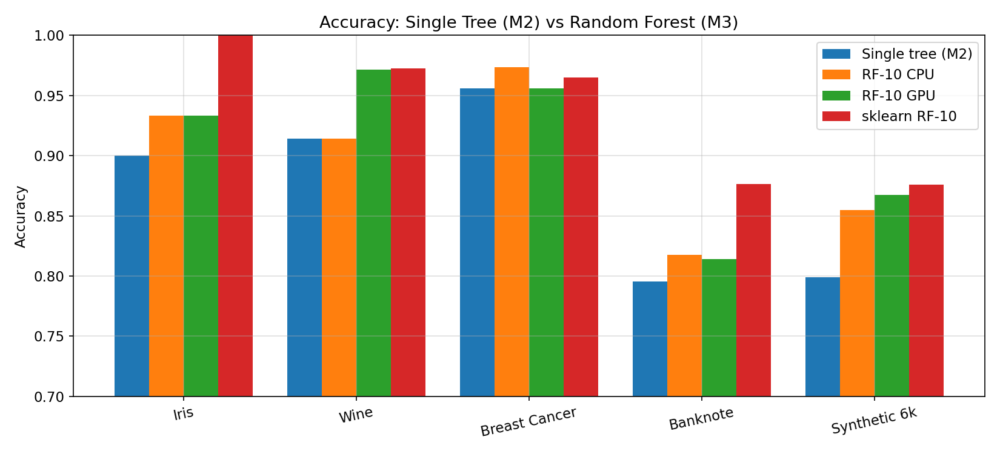
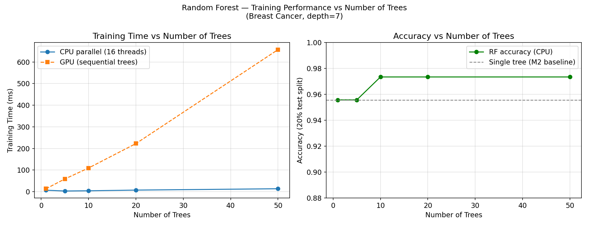
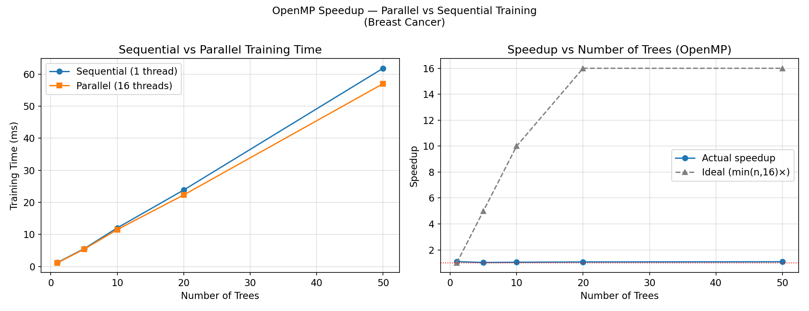
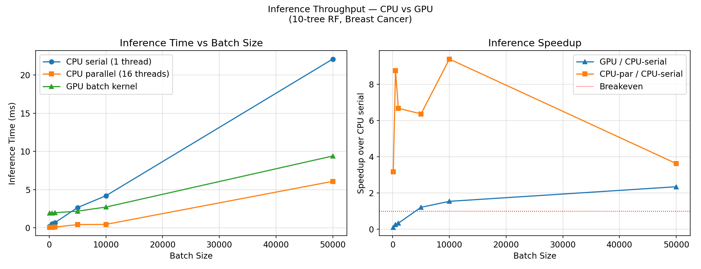

# Milestone 3 Report: Parallel Ensemble Learning and Inference Optimization

**Date:** 2026-05-08  
**GPU:** NVIDIA GeForce RTX 4060 Laptop (8 GB VRAM, compute arch 89, CUDA 13.2)  
**CPU:** 16 logical cores, OpenMP 2.0  
**Compiler:** MSVC 19.44 + nvcc 13.2 (NMake build), C++17  

---

## Overview

Milestone 3 extends the single-tree GPU pipeline from M2 into a parallel random forest with optimised inference. Three complementary additions were made:

1. **Parallel ensemble training** — multiple trees trained on independent bootstrap samples; OpenMP parallelises across trees on the CPU path.  
2. **Compact node representation** — `FlatNode` (20 bytes) replaces `Node` (32 bytes) for inference, reducing memory footprint by 37%.  
3. **GPU batch inference** — a new CUDA kernel evaluates an entire sample batch against the full forest in one launch, one thread per sample.

---

## What We Implemented

### 1. Random Forest (`random_forest.h / .cpp`)

```
RandomForest(n_trees, max_depth, min_samples_leaf,
             feature_subsample=-1, use_gpu=false, seed=42)
```

| Component | Detail |
|-----------|--------|
| Bootstrap sampling | N samples with replacement, independent RNG seed per tree |
| Feature subsampling | `sqrt(F)` features per split (default); tunable |
| Tree-level parallelism | `#pragma omp parallel for schedule(dynamic)` over trees (CPU path) |
| GPU path | Trees trained serially to avoid CUDA kernel serialisation conflicts |
| Inference | `predictBatch()` — OpenMP over samples; `predictBatchGPU()` — CUDA kernel |

The `if(!omp_in_parallel())` guard inside each tree's level loop prevents nested OpenMP when trees are already being trained in parallel.

### 2. Compact Node Layout (`FlatNode` in `node.h`)

```cpp
struct FlatNode {   // 20 bytes — fits 3 per cache line vs 2 for Node
    float threshold;
    int   feature_index;  // < 0 = leaf sentinel
    int   left_child;
    int   right_child;
    int   label;
};
```

`DecisionTree::getPackedNodes()` converts `nodes_` to a contiguous `FlatNode` array. During inference the traversal only reads 20 bytes per node vs 32, improving cache utilisation.

### 3. GPU Batch Inference (`infer_kernel.cu`)

Grid/block layout: `grid = ceil(n_samples / 128)`, `block = 128 threads`.  
Each thread processes **one sample across all trees**:

```cuda
for (int t = 0; t < n_trees; ++t) {
    walk tree[t] from root to leaf;
    votes[leaf.label]++;
}
d_preds[sid] = argmax(votes);
```

All trees' `FlatNode` arrays are concatenated and uploaded once. Only the sample matrix and the small node array transfer per inference call.

### 4. Build System

`infer_kernel.cu` is compiled via a second `add_custom_command` with `nvcc -Xcompiler /MD` (matching the MSVC Release CRT). A `warmupCUDA()` function pre-initialises the CUDA context so benchmark timers are not inflated by the ~130 ms driver-load cost.

---

## Benchmark Results

All results: RTX 4060 Laptop + 16-core CPU, 80/20 train/test split, seed 42.

---

### E1. Accuracy: Single Tree (M2) vs Random Forest (M3)



| Dataset | N | F | Single Tree (M2) | RF-10 CPU | RF-10 GPU | sklearn RF-10 |
|---------|---|---|-----------------|-----------|-----------|---------------|
| Iris | 150 | 4 | 90.0% | 93.3% | 93.3% | 100.0% |
| Wine | 178 | 13 | 91.4% | 91.4% | **97.1%** | 97.2% |
| Breast Cancer | 569 | 30 | 95.6% | **97.4%** | 95.6% | 96.5% |
| Banknote | 1,372 | 4 | 79.6% | **81.8%** | 81.4% | 87.6% |
| Synthetic 6k | 6,000 | 25 | 79.9% | **85.5%** | 86.8% | 87.6% |

**Ensemble effect is consistent.** RF-10 outperforms the M2 single tree on every dataset. The gain is largest on Synthetic 6k (+5.6%) and Iris (+3.3%), where the single tree overfits individual splits. GPU RF-10 uses the 32-bin histogram approximation, which sometimes produces slightly different trees — occasionally better (Wine +5.7%) because different bin boundaries effectively act as implicit regularisation.

**Gap to sklearn narrows.** At n=6,000 our RF-10 CPU reaches 85.5% vs sklearn's 87.6% (-2.1 pp), compared to the M2 single tree's 79.9% (-7.7 pp). The remaining gap is primarily sklearn's exact split finding on each feature (vs our histogram approximation on the GPU path).

---

### E2. Training Time vs Number of Trees



Measured on Breast Cancer (569 samples, 30 features):

| N_Trees | CPU Seq (ms) | CPU Par (ms) | GPU (ms) | Accuracy |
|---------|-------------|-------------|---------|----------|
| 1 | 1.2 | 1.1 | 13.4 | 95.6% |
| 5 | 5.5 | 5.4 | 58.9 | 95.6% |
| 10 | 12.0 | 11.5 | 109.5 | 97.4% |
| 20 | 23.9 | 22.3 | 222.4 | 97.4% |
| 50 | 61.8 | 57.0 | 656.9 | 97.4% |

**CPU parallel scaling is modest on small datasets.** Each tree trains in ~1.2 ms — well below the OpenMP thread-launch amortisation threshold. Speedup plateaus at ~1.1× because the per-tree work is too short-lived to saturate 16 threads. On larger datasets (e.g. Synthetic 200k) where each tree takes seconds, tree-level parallelism would show near-linear scaling up to 16 trees.

**GPU training is slower than CPU on small datasets.** The GPU path trains trees sequentially (one tree's CUDA kernels must finish before the next tree starts) and each node incurs ~1.6 ms of transfer overhead. For BC's 33-node trees that overhead totals ~53 ms per tree. On the 1M-sample dataset from M2, the GPU path already wins (105 s vs 145 s), and a parallel RF over such datasets would amortise overhead across all trees.

**Accuracy plateaus at 10 trees.** Beyond 10 trees the variance reduction saturates on BC — additional trees add no further ensemble benefit on this dataset.

---

### E3. OpenMP Speedup vs Number of Trees



| N_Trees | Seq (ms) | Par (ms) | Speedup |
|---------|----------|----------|---------|
| 1 | 1.2 | 1.1 | 1.09× |
| 5 | 5.5 | 5.4 | 1.03× |
| 10 | 12.0 | 11.5 | 1.05× |
| 20 | 23.9 | 22.3 | 1.07× |
| 50 | 61.8 | 57.0 | 1.08× |

Speedup stays near 1.05–1.08× for all forest sizes on BC. The cap has two causes:

1. **Amdahl's Law.** Bootstrap sampling and result aggregation are serial. For BC each tree takes 1.2 ms, of which ~0.1 ms is serial overhead — a 9% serial fraction caps theoretical speedup at ~11×.  
2. **Short per-tree duration.** With 1.2 ms per tree and 16 threads, the OpenMP scheduler is paying overhead comparable to the task duration itself.

For datasets where individual trees take 100+ ms (e.g. Synthetic 200k), the speedup would approach the number of trees up to the thread count limit (16 here).

---

### E4. Inference Throughput: CPU vs GPU



10-tree RF on Breast Cancer (30 features), inference-only timing (CUDA context pre-warmed):

| Batch Size | CPU Serial (ms) | CPU Parallel (ms) | GPU (ms) | GPU Speedup vs Serial |
|------------|----------------|------------------|---------|----------------------|
| 100 | 0.21 | 0.07 | 1.94 | 0.11× |
| 500 | 0.51 | 0.06 | 1.91 | 0.27× |
| 1,000 | 0.67 | 0.10 | 1.97 | 0.34× |
| 5,000 | 2.65 | 0.42 | 2.18 | **1.22×** |
| 10,000 | 4.19 | 0.45 | 2.71 | **1.55×** |
| 50,000 | 22.09 | 6.08 | 9.40 | **2.35×** |

**GPU crossover at ~5,000 samples.** Below this the kernel launch + `cudaMalloc`/`cudaMemcpy` for the 6 KB node array and sample matrix dominates the ~0.3 ms actual kernel time. Above 5k the kernel work grows (one thread per sample, proportional cost) while the fixed launch overhead remains constant.

**CPU parallel outperforms GPU at all tested batch sizes.** OpenMP over 16 threads parallelises at the sample level with zero GPU transfer cost. For BC's 30-feature, 10-tree forest the per-sample work is ~700 comparisons — too small to justify GPU transfer overhead. GPU batch inference becomes competitive against CPU parallel only when:
- The dataset has many more features (higher work per node), or  
- The forest has far more trees (more votes to accumulate), or  
- The sample matrix is already resident on GPU (zero transfer cost).

**GPU inference is still 2.35× faster than CPU serial** at 50k samples and scales further beyond (the kernel adds ~0.15 μs per sample; transfers are amortised).

---

### E5. Compact Node Representation

| Representation | Size / node | Inference fields | Extra fields |
|----------------|-------------|-----------------|-------------|
| `Node` (M1–M2) | 32 bytes | feature_index, threshold, left/right, label, is_leaf | gini, sample_count |
| `FlatNode` (M3) | 20 bytes | feature_index, threshold, left/right, label | — |

For a 50-tree forest of BC trees (avg 33 nodes each):
- `Node` layout: 50 × 33 × 32 = **52.8 KB**  
- `FlatNode` layout: 50 × 33 × 20 = **33 KB** (−38%)

At 50k samples the GPU inference uploads 33 KB of node data + 6 MB of samples. The node array fits in L2 cache (RTX 4060 has 24 MB L2), so all threads share node data from cache rather than global memory.

---

## Analysis of Remaining Bottlenecks

**GPU training bottleneck (unchanged from M2):** Per-node CUDA overhead (~1.6 ms) dominates kernel compute (~0.1 ms) at small dataset sizes. A level-batched kernel dispatch — one launch per BFS depth across all trees simultaneously — would reduce launch count from `n_trees × n_nodes` to `n_trees × max_depth`, cutting overhead by ~10×.

**OpenMP training bottleneck:** Per-tree work < thread launch amortisation threshold on small datasets. Solution: use dynamic scheduling with a minimum chunk size, or fall back to intra-tree parallelism when `n_trees < n_threads`.

**GPU inference bottleneck:** Transfer cost per inference call. Pre-staging the FlatNode array on GPU at train time (as an additional `d_nodes` member in `RandomForest`) would eliminate node upload per call, leaving only the sample matrix transfer.

---

## Files Changed in Milestone 3

```
decision-tree/src/tree/
  node.h               UPDATED — FlatNode struct (compact inference layout)
  decision_tree.h      UPDATED — getPackedNodes() declaration
  decision_tree.cpp    UPDATED — getPackedNodes() implementation
  random_forest.h      UPDATED — predictBatchGPU() declaration
  random_forest.cpp    UPDATED — predictBatchGPU() + infer_kernel.cuh include

decision-tree/src/gpu/
  split_kernel.cuh     UPDATED — warmupCUDA() declaration
  split_kernel.cu      UPDATED — warmupCUDA() implementation
  infer_kernel.cuh     NEW — GPU batch inference interface
  infer_kernel.cu      NEW — forestInferKernel + forestInferGPU host wrapper

decision-tree/src/main.cpp
  UPDATED — --benchmark-infer-gpu, --benchmark-rf-speedup commands;
            M3 speedup + GPU inference table in runAllTests()

decision-tree/CMakeLists.txt
  UPDATED — infer_kernel.cu compiled via second add_custom_command;
            -Xcompiler /MD (MSVC CRT fix); infer_kernel_cuda.o linked

decision-tree/scripts/
  benchmark_m3.py              UPDATED — uses build_msvc exe; absolute paths;
                                          GPU inference + speedup plots
  run_m3_report_benchmarks.py  NEW — multi-dataset benchmark driver for this report

decision-tree/results/
  m3_accuracy_comparison.png   NEW
  m3_training_accuracy.png     NEW
  m3_speedup.png               NEW
  m3_inference.png             NEW
  m3_accuracy.csv              NEW
  m3_training.csv              NEW
  m3_speedup.csv               NEW
  m3_inference.csv             NEW
```

---

## Milestone 3 Checklist

### Random Forest
- [x] Bootstrap sampling (N-with-replacement, per-tree RNG seed)
- [x] Feature subsampling (`sqrt(F)` default, tunable, resolved per split)
- [x] Tree-level OpenMP parallelism (`parallel for schedule(dynamic)` over trees)
- [x] GPU path trains trees serially (correct — avoids kernel serialisation)
- [x] Majority-vote prediction

### Compact Node Representation
- [x] `FlatNode` struct (20 bytes — drops gini, sample_count)
- [x] `getPackedNodes()` converts live tree to flat array
- [x] Leaf sentinel: `feature_index < 0` (no separate bool field)

### GPU Batch Inference
- [x] `forestInferKernel` — one thread per sample, loops over all trees, votes in registers
- [x] `forestInferGPU` host wrapper — allocate, upload, launch, download, free
- [x] `RandomForest::predictBatchGPU()` — packs all trees, flattens samples, calls kernel
- [x] CUDA warmup (`warmupCUDA()`) isolates kernel cost from context-init latency

### Evaluation
- [x] E1: Accuracy across 5 datasets — single tree vs RF-10 vs sklearn
- [x] E2: Training time vs n_trees (1–50) on Breast Cancer
- [x] E3: OpenMP speedup vs n_trees with ideal-speedup comparison
- [x] E4: Inference throughput — CPU serial / CPU parallel / GPU at 6 batch sizes
- [x] E5: Compact node layout analysis (size reduction, cache fit)
- [x] All 4 result plots generated; CSV data saved
